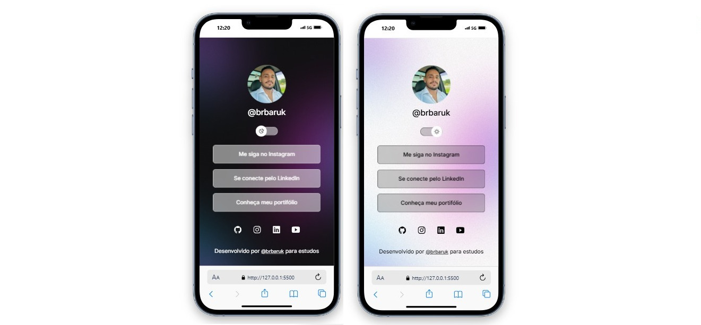

<h1 align="center"> Social Links </h1>

Projeto realizado para fins de estudos.

  <a href="#-tecnologias">Tecnologias</a>&nbsp;&nbsp;&nbsp;|&nbsp;&nbsp;&nbsp;
  <a href="#-projeto">Projeto</a>&nbsp;&nbsp;&nbsp;|&nbsp;&nbsp;&nbsp;
  <a href="#memo-licença">Licença</a>

 

 

  
  

  

##  Tecnologias

Esse projeto foi desenvolvido com as seguintes tecnologias:

- HTML e CSS
- JavaScript
- Git e Github
- Figma

##  Projeto

O Social links é um agregador de links, para ser utilizado como cartão de visita online em redes sociais.

##  Licença

Esse projeto está sob a licença MIT.

---

Desenvolvido por <a href="https://www.linkedin.com/in/bruno-r-de-godoi2018/">@BrBaruk</a> para fins de estudos.
